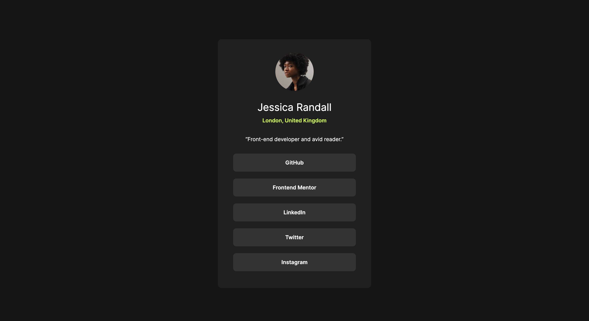

# Frontend Mentor - Social links profile solution

This is a solution to the [Social links profile challenge on Frontend Mentor](https://www.frontendmentor.io/challenges/social-links-profile-UG32l9m6dQ). Frontend Mentor challenges help you improve your coding skills by building realistic projects. 

## Table of contents

- [Overview](#overview)
  - [The challenge](#the-challenge)
  - [Screenshot](#screenshot)
  - [Links](#links)
- [My process](#my-process)
  - [Built with](#built-with)
  - [What I learned](#what-i-learned)
  - [Continued development](#continued-development)
  - [Useful resources](#useful-resources)
- [Author](#author)
- [Acknowledgments](#acknowledgments)

## Overview

### The challenge

Users should be able to:

- See hover and focus states for all interactive elements on the page

### Screenshot

### Links

- Live Site URL: [View site](https://veyronshark.github.io/FrontendMentor-social-links-profile-solution/)

## My process

### Built with

- Semantic HTML5 markup
- CSS media selectors
- Flexbox

### What I learned

I learnt how to use media selectors to style the page for different screen sizes and I also learnt how to import my own font files into my project. I also learnt how to use the calc() function.

### Continued development

I will continue to look further into responsiveness and how to make it efficient

## Author

- Frontend Mentor - [@VeyronShark](https://www.frontendmentor.io/profile/VeyronShark)

## Acknowledgments

I send my regards to [freeCodeCamp](https://www.freecodecamp.org) and [Colt Steele](https://www.udemy.com/user/coltsteele/?srsltid=AfmBOop0NGbVNsQdQFTNI0qbD03-TLUUHoXJpW2wvThgUzgP0JtBKV-d) who taught me concepts to tackle this problem. It was a simple one but it is a start
